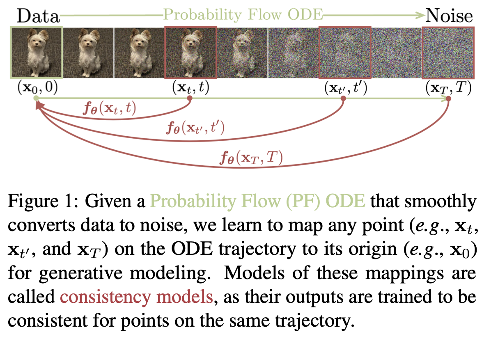

Link: https://arxiv.org/pdf/2303.01469.pdf

## Overview

- Diffusion models have been the key breakthrough in recent generative models across many modalities (image, video, audio, etc).
- Diffusion models require an iterative approach to generate their outputs (generally, iterating from random noise, conditioned on input text), leading to slow sampling speeds, problems for real-time use, higher resource demands (to some extent)
  - _"the iterative generation procedure of diffusion models typically requires 10–2000 times more compute "_
- Consistency models:
  - _"we build on top of the probability flow (PF) ordinary differential equation (ODE) in continuous-time diffusion models (Song et al., 2021), whose trajectories smoothly transition the data distribution into a tractable noise distribution. We propose to learn a model that maps any point at any time step to the trajectory’s starting point. A notable property of our model is self-consistency: points on the same trajectory map to the same initial point."_
- No Adversarial training.
- Doesn't restrict architectural choices. 
- Can produce consistency model from diffusion model (), or from scratch.
- Can still perform zero-shot tasks. 

## Consistency models
 - Define consistency model as function, $f(x, t)$, $t \[ \epsilon , T \] $.
    - Key property: $f(x_t, t) = f(x_{t'}, t')$, i.e. entirely surjective.
    - Boundary Condition: $f(x_{\epsilon}, \epsilon) = x_{\epsilon}$, i.e. boundary condition
      - Enforced by:
        - Explicitly in parameterisation of $f$
        - Use skip connections with $f(x, t) = \delta_{\epsilon, 1}x + \delta_{\epsilon,0} F(x, t)$ (used in experimentally in paper)

- To sample, generate from $x_T = \mathcal{N}(0, T^2I)$, then apply $f(x_T, T)$
  - Still supports multi-step, multi- improvements, $x = f(x + \sqrt{\tau_n^2 - \epsilon^2}\mathcal{z}, \tau_n), \quad \mathcal{z} \backsim N(0, 1)$, $\{\tau_i\}_{i=1}^{N-1}$ are timesteps.

## Links
 - [Score-based generative modeling with stochastic differential equations (SDEs)](https://yang-song.net/blog/2021/score/#score-based-generative-modeling-with-stochastic-differential-equations-sdes): A primer on SDEs and how they fit with respect to generative models.